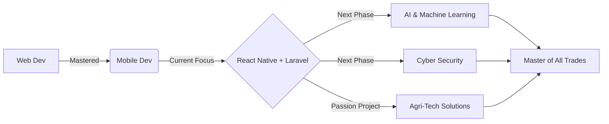

# 🧠 JohnboscoCJT | BraintelTech Founder

> **Renew.Rewire.Practice.Connect.Become**

📍 **Tanzania 🇹🇿** | 🚀 **Mobile, Web & API Architect** | 🌱 **Agri-Tech Enthusiast**  
🐧 **Ubuntu Host** | 🥷 **Kali Virtual** | 🪟 **Windows Legacy**  
✝️ **Believer in Jesus Christ**

---
# "Out here doing some Alien things, Jesus is King..." ~johnboscocjt (Isaiah 28:21)
---

## 👋 About Me
I am a **Computer Science enthusiast** who believes in understanding the *kernel* of things, not just the surface. I don't just build apps; I build understanding. 

My journey started on Windows, but necessity forced me into the arms of **Linux**. Now, I run a **Triple-OS Environment** (Ubuntu Mother + Kali & Windows VMs) to ensure I can code, hack, and compatibility-test on a non-high-end machine. 

I am transitioning from a **Jack of All Trades** to a **Master with a Plan**. 
*   **Past:** Web Development (Laravel/PHP).
*   **Present:** Mobile Development (React Native) + API Design.
*   **Future:** AI, Machine Learning, Cyber Security & **Agri-Tech Solutions**.

My goal? To elevate **Tanzania's tech status** in East Africa and the world, one commit at a time, while nurturing life through agriculture.

---

## 🛠️ The Tech Stack


**Core Focus:** `Full Stack Web` `Mobile Development` `Data Structures & Algorithms` `Ethical Hacking & Tool Creation` `AI & Machine Learning`  
**More Experienced In:** `Java` `C++`  
**Also Experienced In:** `C` `C#` `.NET` `Dart/Flutter` `Git` `Python & Django`

---

## 🚀 Project Portfolio
*Building knowledge by practicing knowledge.*

### 🔴 Live & Current
| Project | Description | Stack | Status |
| :--- | :--- | :--- | :--- |
| **[BraintelTech Hub](#)** | The main ecosystem for my tools and experiments. | `React` `Node` | 🟢 Live |
| **[Mobile App Name](#)** | Cross-platform mobile solution solving local problems. | `React Native` `Laravel API` | 🟡 Building |
| **[API Service](#)** | Robust backend architecture for mobile clients. | `Laravel` `PHP` `MySQL` | 🟢 Live |

### 🟡 Past & Experiments
| Project | Description | Stack | Status |
| :--- | :--- | :--- | :--- |
| **[Flutter Trial](#)** | Early experiments with Dart before choosing RN. | `Flutter` `Dart` | 🟠 Archived |
| **[VFX Mobile](#)** | Hollywood-style visual effects created on phone. | `Mobile Tools` | 🟠 Hobby |
| **[Legacy Web](#)** | Previous web applications built during learning phase. | `PHP` `JS` | 🟠 Archived |

*(Links will be updated as repositories go public)*

---

## 🧪 The Lab (System Setup)
*Optimizing low-end hardware for high-end performance.*

```bash
johnbosco@tanzania:~$ neofetch

OS: Ubuntu (Mother) 
VMs: Kali Linux (Security), Windows 10 (Compat)
Shell: Bash 5.0
Editor: VS Code / Vim
Mission: Ethical Hacking & Development
```

I enable my machine to operate **3 OSs simultaneously**. This allows me to develop securely, test ethically, and maintain compatibility without needing expensive hardware. **Resourcefulness > Resources.**

---

## ✝️ Faith & Foundation
*My strength and guidance beyond code.*

> **Jesus Christ** is my Lord and Savior, who helped channel this life in different views ever. He is the root of my resilience and creativity.

*   📖 **Philippians 4:13** - *"I can do all things through Christ who strengthens me."*
*   📖 **Romans 8:28** - *"And we know that in all things God works for the good of those who love him."*

---

## 🎨 Creative Core & Life Passions
*Code is art, but so is life, nature, and growth.*

*   **🌱 Farming & Agriculture:** I have a deep love for tilling the soil and watching crops grow. I see parallels between nurturing a farm and nurturing a codebase—both require patience, planning, and care.
*   **🐄 Animal Keeping:** Raising and caring for animals is a joy. It teaches responsibility and connects me to the rhythms of life.
*   **🎵 Music Writing:** Composing beats and lyrics when the compiler needs a break.
*   **🎬 Videography & VFX:** Creating content and mobile VFX. I tell stories visually.
*   **📸 Photography:** Capturing the world through a lens.
*   **✍️ UI Design:** I design interfaces with **Pen & Paper** first. No Figma crutches. Just raw creativity on a special piece of paper.
*   **🕺 Dancing:** *Deprecated Module.* (Stopped professionally, but the rhythm helps my code flow).

---

## 🎓 Teaching & Community
> "I love teaching and breaking concepts of computer science to newbies and all people of age."

*   **Workflow Thief:** I love working with people to **steal their workflows** and optimize my own.
*   **Mentorship:** Breaking down complex CS topics for beginners.
*   **National Goal:** Making Tanzania a tech hub in East Africa.

---

## 📈 GitHub Activity


---

## 🗺️ The Roadmap


---

## 📬 Connect With The Node
*Let's build something great together.*

[](https://github.com/JohnboscoCJT)
[](https://www.linkedin.com/in/YOUR_LINKEDIN_HERE)
[](mailto:YOUR_EMAIL_HERE)
[](https://twitter.com/YOUR_TWITTER_HERE)

---

### 🧠 Random System Logs
<details>
<summary>🔓 Click to decrypt hidden facts</summary>

- 🇹🇿 **Location:** Tanzania, East Africa.
- 🖊️ **Design Tool:** Pen & Paper > Digital Tools.
- 🐧 **OS:** Ubuntu is home, Kali is the playground.
- 🌾 **Side Quest:** Farmer & Animal Keeper at heart.
- 🎵 **Hobby:** Music Producer & VFX Artist.
- 🎯 **Philosophy:** "Instead of being jack of all trades with no plans, I am becoming one with a plan and master all at the end."
- 🤝 **Collaboration:** Open to stealing... I mean, *learning* workflows from you.
- ✝️ **Faith:** Guided by Grace.

</details>

---

<p align="center">
  <i>Renew.Rewire.Practice.Connect.Become</i><br>
  <b>BraintelTech</b> © 2026
</p>
